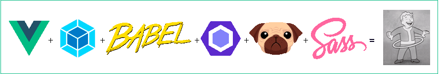
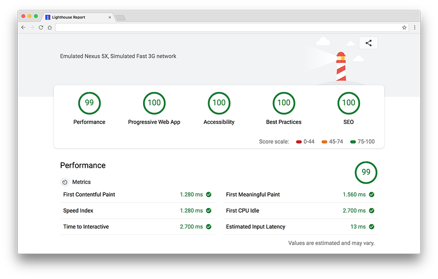

# Vue Modern Boilerplate

[](README.md)

A tweak-friendly starter project skeleton to build [Vue.js](https://vuejs.org) single page apps or sites. Created through [Vue CLI 3](https://cli.vuejs.org/) and built on top of [webpack](https://webpack.github.io/), it uses modern JavaScript syntax with [ES6](https://github.com/lukehoban/es6features) features via [babel](https://babeljs.io/) to start integrating the best tools in the **frontend ecosystem**.

**Note:** _This is a personal vue.js starter boilerplate, it may not be a good approach for your project(s)._

## Development experience

- **Full flexibility.** Tweak the config of each open source tool
- **Optimized for most apps.** Reliable development server featuring _live-reload_, _hot-module-replacement_, _lint-on-save_, _static assets handling_ & _css extraction_, ...
- **Pre-processor support.** _Pug_, _Scss/Sass_, _Less_, _Stylus_ or _TypeScript_ compilation, just to name a few, powered by `vue-loader`. You can even use **CSS Modules** inside components with `<style module>`
- **Modern build tools.** Build the `.vue` components as native web components shipping native ES2015 code to modern browsers that support it with auto fallback to a legacy bundle for olders browsers that do not
- **Improved website/app loading performance.** Production-ready bundles optimized with minification for JS/CSS/HTML, auto vendor chunk splitting for better caching, HTML injection, offline mode with a Service Worker, PWA-ready features like ms-browserconfig, the manifest, a mobile-friendly meta-viewport or the app favicons. The goal is **a Lighthouse/PageSpeed score of 90+/100** 💉



### Under the hood

{ [...](package.json) }

## Requirements

Make sure you have the following installed:

- [Vue Cli](https://github.com/vuejs/vue-cli) (version 3)
- [Node](https://nodejs.org/en/) (at least the latest LTS)
- [Yarn](https://yarnpkg.com/lang/en/docs/install/) (at least 1.0)

## Installation

```bash
# Clone the project and navigate into the directory
# of the repository, then install dependencies
yarn install
```

## Build Setup

```bash
# Launch the dev server
yarn dev

# Build for production
yarn build

# Build the application targeting modern browsers
# with auto fallback for legacy
yarn build --modern

# Outputs a stringified version of the webpack
# config inside the root folder
yarn inspect:dev
yarn inspect:prod

# see: https://cli.vuejs.org/guide/cli-service.html
```

**Remember** to update the following files to suit your application before building for production:

- `.env` and `app.config.js`
- `/public/` directory

## Contributions are always welcome

- [x] Fork It And Make Your Own™

- [x] Tweak the code as you wish

- [ ] Submit an issue or PR!

## License

This is free software; you can redistribute it and/or modify it under the terms of the [MIT license](LICENSE).
